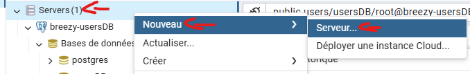
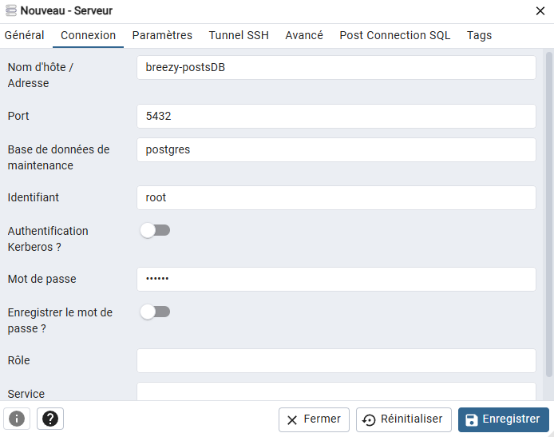
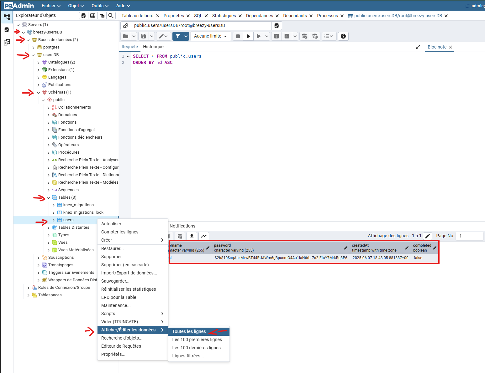

# Installation :

DEVELOPPEMENT : 
use `docker compose --profile dev up --watch`
connect with : `https://localhost:8443/`


PRODUCTION : 
use `docker compose --profile production up --build`
connect with : `https://localhost:8443/`


# Important : 
- Faire `npm install` dans chaque dossier backend avant de lancer les containers quand on est en mode développement. (Le fait tout seul en mode production)

- On stock les dates en UTC, faut les recup et les afficher avec +2h si besoin

- On code en CommonJS et non en ES Modules comme dans les WS 

CommonJS : 
```js
class User extends Model {
  // ...
}

module.exports = User;

Ou : 

exports.login = (req, res) => { ... };
```

ES Modules : 
```js
export default class User extends Model {
  // ...
}

Ou : 

export const login = (req, res) => { ... };
``` 

# Administration : 
En mode dev vous pouvez voir les DB via PgAdmin 4 et Mongo-Express.

## Identifiants PGAdmin 4 : 
lien : `http://localhost:8080`
mail : `admin@breezy.com`
password : `admin`

## Ajouter une DB : 


(On utilise les mêmes infos de connexion pr les 3 bases sauf le nom d'hôte qui change)


## Lire les données d'une DB : 



## Identifiants Mongo-Express : 
lien : `http://localhost:8081/`
username : `admin`
password : `password`


# Commandes utiles : 
Créer une migration : 
`npx knex migrate:make create_users_table --migrations-directory migrations`

Créer un seed : 
`npx knex seed:make 001_roles`

Migréer : 
`npx knex migrate:latest --knexfile knexfile.js`

Seeder :
`npx knex seed:run --knexfile knexfile.js`


npx knex migrate:make create_follows_table --migrations-directory migrations